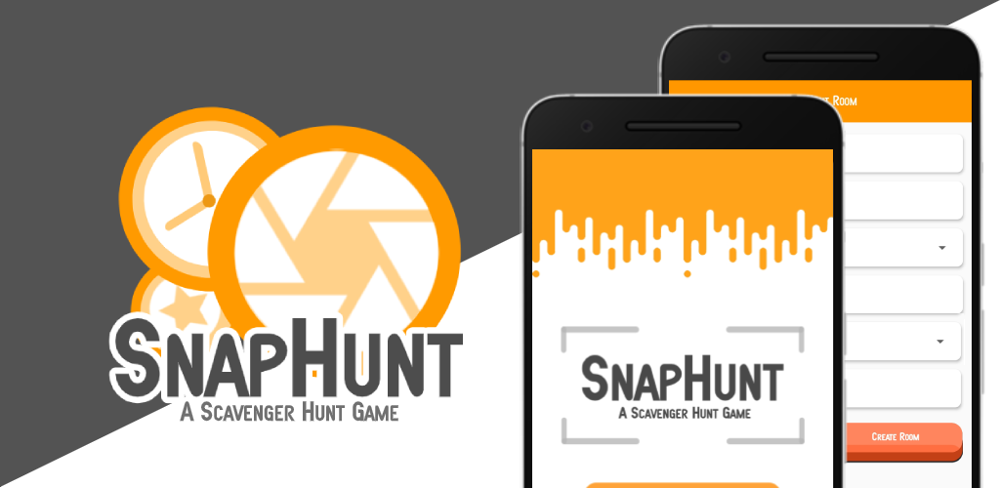
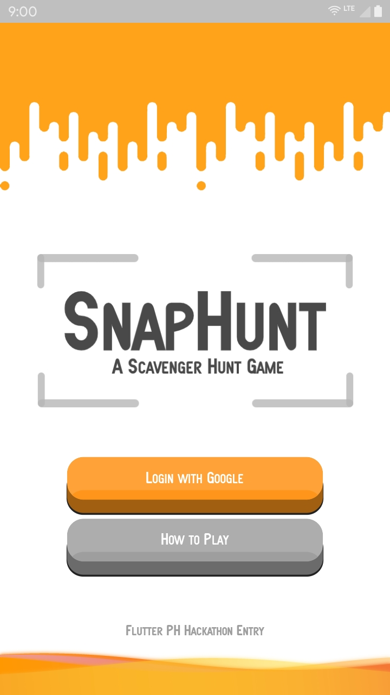
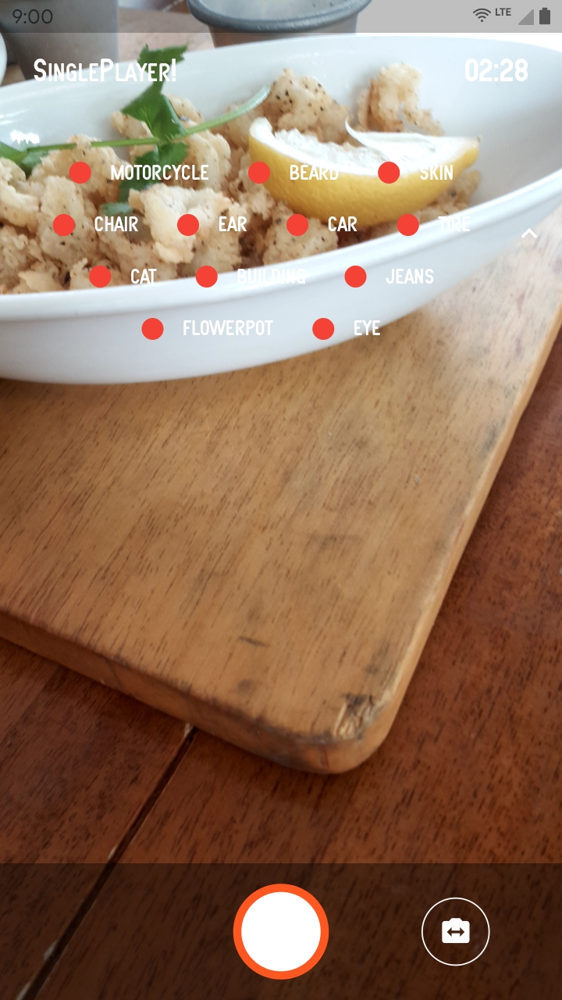
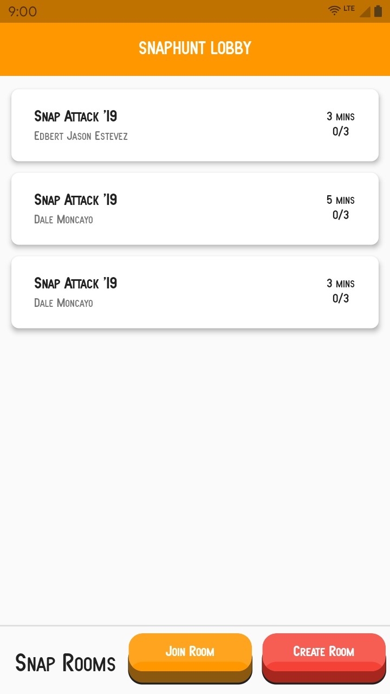

# SnapHunt

<br />
<p align="center">
    

</p>

<a href='https://play.google.com/store/apps/details?id=com.em2.snaphunt'></a>

SnapHunt is a scavenger hunt game where a player can invite other players on a real world scavenger hunt while using the app as the item identifier by taking a picture of it. Using machine learning technology, the app identifies and scores the player according. Users can play solo or with a group. First player to complete the scavenger hunt or the player the the highest score after countdown ends wins.

A Flutter PH Hackathon 2019 Entry!

## Features
* Single player Scavenger hunt
* Multiplayer Scavenger hunt
* Login via Google Authentication
* Offline Machine learning using ML Kit
* Multiplayer games using Firestore
* Join room via QR code
* Real time score updates in-game
* Pre defined words using Hive
* Update words via Firestore console
* Share results with your friends
  
  ## Screenshots
  <p align="center">
  
  
  
</p>

## Download & Install

You may install SnapHunt via [PlayStore](https://play.google.com/store/apps/details?id=com.em2.snaphunt), installing the apk from [the release section](https://github.com/snap-hunt/snaphunt/releases), or build the app yourself. 

## Getting Started

These instructions will get you a copy of the project up and running on your local machine for development and testing purposes. 

### Prerequisites

Download either Android Studio or Visual Studio Code, with their respective [Flutter editor plugins](https://flutter.io/get-started/editor/). For more information about Flutter installation procedure, check the [official install guide](https://flutter.io/get-started/install/).

### Steps
1. Clone the repository with the 'clone' command, or just download the zip.

```
$ git clone https://github.com/snap-hunt/snaphunt.git
```

2. Install dependencies from pubspec.yaml by running `flutter packages get` from the project root (see [using packages documentation](https://flutter.io/using-packages/#adding-a-package-dependency-to-an-app) for details and how to do this in the editor). 


3. Follow [Option 1 instructions here up to Step 3](https://firebase.google.com/docs/android/setup#console). Be sure to configure your SHA-1 or SHA-256 hash in the Firebase Project Settings for your app.

4. Place the downloaded 'google-services.json' file from Step 1 above in your
     projects <flutter-project>/android/app/ directory.

5. Go to the Firebase Console and then to the Authentication section and then
     on to the "Sign-in method" tab an enable Email/Password and Google Sign in methods.
6. Configure Firestore in your Firebase console

7. Add `words` collection with `words` document side.

8. Inside the `words` document, add `version` with int value 1. And `words` array with the words the app with be using.

9. Build the app!

## Built With

* [Flutter](https://flutter.dev/) - <3
* [Firestore](https://firebase.google.com/docs/firestore) - Realtime Database
* [Firebase Auth](https://firebase.google.com/docs/auth) - Google Authentication
* [ML Kit](https://firebase.google.com/docs/ml-kit) - Machine learning
* [Hive](https://docs.hivedb.dev/) - Local data persistence

## Contributing

Contributions are welcome! Submit an issue for discussion and a PR for the code.

> **Note:** Code is dirty and rushed. This was made in our free time in the short duration of the hackathon. Don't judge us too harshly :D 


## Authors

*  **Justin Enerio**
*  **Edbert Estevez**
*  **Dale Moncayo**
*  **King Montayre**

See also the list of [contributors](https://github.com/snap-hunt/snaphunt/graphs/contributors) who participated in this project.

## License

This project is licensed under the MIT License - see the [LICENSE.md](./LICENSE.md) file for details

## Acknowledgments

* Flutter PH for hosting this hackathon
